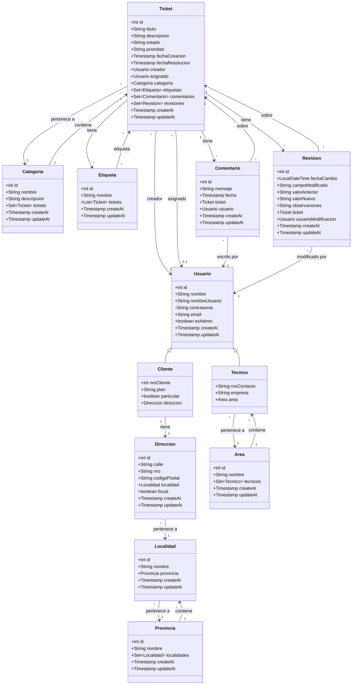

# 🛠️ Sistema de Gestión de Tickets - Grupo 25 (OBJ2) - Hibernate Nivel 2 (Recuperatorio)

## 📐 Diagrama de Clases (Mermaid)

A continuación se muestra el diagrama de clases principal del dominio del sistema, generado a partir de las clases en `src/datos` y sus relaciones según los mapeos de Hibernate en `src/mapeos`



## 📋 Requisitos Previos

- Java JDK 12
- MySQL 8.0+

## ⚙️ Configuración de la Base de Datos

La configuración de la base de datos se realiza mediante el archivo `src/hibernate.cfg.xml`. Asegúrate de que los valores coincidan con tu entorno de MySQL. Ejemplo de configuración:

```xml
<property name="connection.driver_class">com.mysql.cj.jdbc.Driver</property>
<property name="connection.url">jdbc:mysql://localhost:3306/hibernate2_db?createDatabaseIfNotExist=true&amp;serverTimezone=America/Argentina/Buenos_Aires</property>
<property name="connection.username">root</property>
<property name="connection.password"></property>
<property name="dialect">org.hibernate.dialect.MySQLDialect</property>
```

> 📌 **Nota:** Podés modificar estos valores en `src/hibernate.cfg.xml` según tu entorno y credenciales.

## 🗄️ Inicialización de la Base de Datos

El proyecto incluye un script SQL (`db.sql`) que contiene el **esquema** de la base de datos necesario para la aplicación.  
Para inicializar la base de datos:

1. Abrí tu gestor de base de datos (por ejemplo, MySQL Workbench, DBeaver, consola, etc.).
2. Ejecutá el script `db.sql` ubicado en la raíz del proyecto para crear las tablas y relaciones necesarias.

> ⚠️ **Importante:** El script no carga datos de prueba, solo estructura la base de datos.

## 🚀 Ejecución del Proyecto

1. Cloná el repositorio:
   ```bash
   git clone [url-del-repositorio]
   cd hibernate2-recuperatorio
   ```

2. Asegurate de que MySQL esté corriendo y la base de datos esté inicializada (ver sección anterior sobre la base de datos y el script `db.sql`).

3. Para probar la solución a los casos de uso del enunciado, ejecutá los diferentes tests ubicados en la carpeta `src/test` desde tu IDE (por ejemplo, Eclipse) o desde la terminal. Cada test corresponde a los siguientes puntos del enunciado:

   - **1.1. Traer todos los objetos de cada una de las clases datos:**
     - Ejecutar `TestTraerDatos.java`
   - **1.2. ABM por lo menos para cuatro clases:**
     - Ejecutar `TestABM.java`
   - **1.3. Mínimo cuatro consultas por algún atributo del tipo clase** y **1.4. Mínimo cuatro consultas por algún atributo de la subclase:**
     - Ejecutar `TestConsultasClase.java`
   - **1.5. Mínimo cuatro consultas por intervalo de fechas** y **1.6. Mínimo cuatro consultas por una fecha y un atributo de clase:**
     - Ejecutar `TestConsultasFechas.java`

> ⚠️ **Importante:** Primero debés ejecutar una vez el test `TestABM.java` para insertar datos de prueba en la base de datos. Luego, podés ejecutar los demás tests para que tengan sentido los resultados de las consultas

> 📝 Todos los tests se ejecutan por consola y muestran los resultados correspondientes a cada punto del enunciado.

## 📦 Dependencias

Todas las dependencias externas (JARs) necesarias se encuentran en la carpeta `lib/`.  
Incluyen Hibernate, el conector de MySQL y cualquier otra librería requerida.

- **¿Cómo agregarlas en tu IDE?**
  - **VSCode:** Usá la extensión "Java Projects" y agregá todos los JARs de la carpeta `lib` al classpath del proyecto.
  - **Eclipse:** Click derecho en el proyecto → Build Path → Configure Build Path → pestaña "Libraries" → "Add external JARs..." y seleccioná todos los archivos de `lib/`.

> 📝 **Nota:** Las dependencias son las mismas que están disponibles en el campus (las de Java 12)

## 🧰 Tecnologías Utilizadas

- **Java 12**
- **Hibernate 5.x** (ORM)
- **MySQL 8.0+**
- **JDBC**
- **Librerías auxiliares** (ver carpeta `lib/`)